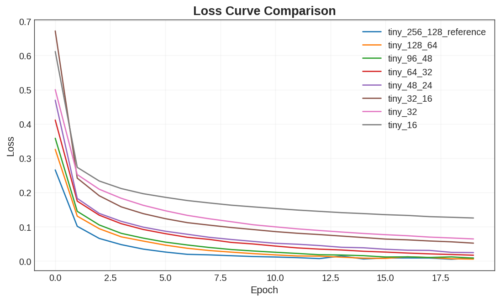
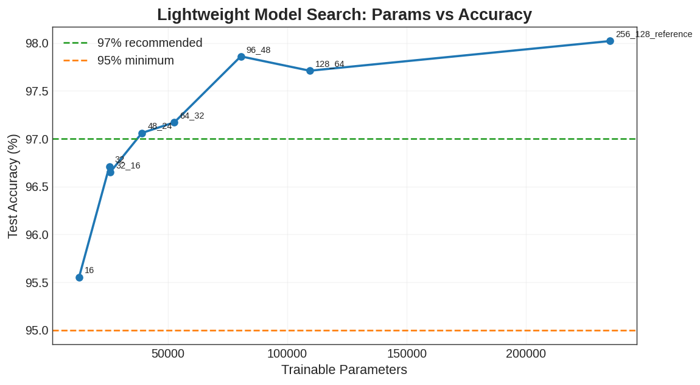

# MNIST Lightweight Model Search Report

## 1. 실험 목적

기존 실험에서는 모델 구조, 활성화 함수, BatchNorm, Dropout, learning rate 등의 설정을 비교하여 높은 정확도를 얻는 데 초점을 두었다. 이번 추가 실험의 목적은 **모델을 어디까지 줄여도 과제 기준을 만족할 수 있는지** 확인하는 것이다.

기준은 다음과 같이 두었다.

| 기준 | 의미 |
| --- | --- |
| 95% 이상 | 원래 과제 기준을 만족하는 최소 통과선 |
| 97% 이상 | 보고서에서 사용한 권장 성능 기준 |

따라서 최종 선택은 `test accuracy >= 97%`를 만족하는 모델 중 파라미터 수가 가장 적은 모델을 찾는 방식으로 진행하였다.

## 2. 실험 설정

모든 모델은 동일한 NumPy MLP 구현과 동일한 학습 루프를 사용하였다.

| 항목 | 값 |
| --- | --- |
| Dataset | MNIST |
| Optimizer | Adam |
| Learning rate | 0.001 |
| Epochs | 20 |
| Batch size | 128 |
| Activation | ReLU |
| Weight initialization | He initialization |
| BatchNorm | 사용하지 않음 |
| Dropout | 사용하지 않음 |

BatchNorm과 Dropout을 제외한 이유는 이전 실험에서 `batchnorm_off` 모델이 더 적은 파라미터와 더 짧은 학습 시간으로도 충분히 높은 정확도를 보였기 때문이다. 이번 실험에서는 정규화 기법보다 **은닉층 크기 자체를 줄였을 때의 영향**을 보는 데 초점을 맞추었다.

## 3. 실험 결과

| 모델 | 구조 | Train accuracy | Test accuracy | Params | Time |
| --- | --- | ---: | ---: | ---: | ---: |
| `tiny_256_128_reference` | 784-256-128-10 | 99.78% | 98.02% | 235,146 | 97.4s |
| `tiny_128_64` | 784-128-64-10 | 99.85% | 97.71% | 109,386 | 53.6s |
| `tiny_96_48` | 784-96-48-10 | 99.85% | 97.86% | 80,506 | 43.6s |
| `tiny_64_32` | 784-64-32-10 | 99.52% | 97.17% | 52,650 | 35.7s |
| `tiny_48_24` | 784-48-24-10 | 99.44% | 97.06% | 39,106 | 30.2s |
| `tiny_32_16` | 784-32-16-10 | 98.63% | 96.65% | 25,818 | 25.7s |
| `tiny_32` | 784-32-10 | 98.37% | 96.71% | 25,450 | 24.1s |
| `tiny_16` | 784-16-10 | 96.46% | 95.55% | 12,730 | 17.0s |

## 4. 가장 가벼운 97% 이상 모델

97% 이상의 test accuracy를 만족하는 모델 중 가장 가벼운 모델은 `tiny_48_24`였다.

| 항목 | 값 |
| --- | --- |
| 모델 | `tiny_48_24` |
| 구조 | 784-48-24-10 |
| Test accuracy | 97.06% |
| Params | 39,106 |
| Time | 30.2s |

기준 모델인 `tiny_256_128_reference`와 비교하면 정확도는 98.02%에서 97.06%로 0.96%p 감소하였다. 하지만 파라미터 수는 235,146개에서 39,106개로 약 83.4% 줄었고, 학습 시간도 97.4초에서 30.2초로 감소하였다.

따라서 과제 기준을 만족하면서 모델 크기와 학습 시간을 가장 줄이고 싶다면 `tiny_48_24`가 가장 적절한 선택이다.

## 5. 정확도와 효율의 균형

정확도 여유까지 고려하면 `tiny_96_48`도 좋은 선택이다.

| 모델 | Test accuracy | Params | Time |
| --- | ---: | ---: | ---: |
| `tiny_48_24` | 97.06% | 39,106 | 30.2s |
| `tiny_96_48` | 97.86% | 80,506 | 43.6s |

`tiny_96_48`은 `tiny_48_24`보다 파라미터 수가 약 2배 많지만, test accuracy가 0.80%p 높다. 즉 **최소 크기**를 가장 중요하게 보면 `tiny_48_24`, **정확도 안정성**까지 고려하면 `tiny_96_48`이 더 좋은 균형점이다.

## 6. 95% 최소 기준 모델

95% 최소 기준만 만족하면 되는 경우에는 `tiny_16`도 가능하다.

| 항목 | 값 |
| --- | --- |
| 모델 | `tiny_16` |
| 구조 | 784-16-10 |
| Test accuracy | 95.55% |
| Params | 12,730 |
| Time | 17.0s |

`tiny_16`은 가장 작고 빠른 모델이지만 97% 권장 기준에는 도달하지 못했다. 따라서 최종 제출용 모델이라기보다는 모델 용량을 극단적으로 줄였을 때의 하한선을 확인하는 참고 결과로 보는 것이 적절하다.

## 7. 과적합 및 과소적합 분석

경량화 실험에서도 일부 과적합 경향이 관찰되었다. 여러 모델에서 train accuracy가 99% 이상까지 올라간 반면, test accuracy는 97~98% 수준에 머물렀다.

| 모델 | Train accuracy | Test accuracy | Gap |
| --- | ---: | ---: | ---: |
| `tiny_256_128_reference` | 99.78% | 98.02% | 1.76%p |
| `tiny_128_64` | 99.85% | 97.71% | 2.14%p |
| `tiny_96_48` | 99.85% | 97.86% | 1.99%p |
| `tiny_64_32` | 99.52% | 97.17% | 2.35%p |
| `tiny_48_24` | 99.44% | 97.06% | 2.38%p |
| `tiny_16` | 96.46% | 95.55% | 0.91%p |

`tiny_48_24`, `tiny_64_32`, `tiny_96_48` 등은 학습 데이터에는 매우 잘 맞지만 test set에서는 성능 향상이 제한되므로 약한 과적합 경향이 있다고 볼 수 있다. 특히 `tiny_48_24`는 train accuracy 99.44%, test accuracy 97.06%로 약 2.38%p의 차이를 보였다.

반면 `tiny_16`은 train/test 차이가 0.91%p로 작지만, train accuracy 자체가 96.46%에 머물렀다. 이는 과적합이 적다기보다는 모델 용량이 부족해서 학습 데이터도 충분히 맞추지 못한 **과소적합**에 가깝다.

## 8. 결론

이번 경량화 실험의 결론은 다음과 같다.

| 목적 | 추천 모델 | 이유 |
| --- | --- | --- |
| 가장 작은 97% 이상 모델 | `tiny_48_24` | 39,106개 파라미터로 97.06% 달성 |
| 정확도와 효율 균형 | `tiny_96_48` | 80,506개 파라미터로 97.86% 달성 |
| 95% 최소 기준 통과 | `tiny_16` | 12,730개 파라미터로 95.55% 달성 |

최종적으로, **과제 권장 기준인 97% 이상을 만족하면서 가장 가벼운 모델은 `tiny_48_24`**이다. 다만 정확도 여유를 더 확보하고 싶다면 `tiny_96_48`이 더 안정적인 선택이다.
