# MNIST NumPy MLP 실험 보고서

## 0. 반·팀원

| 항목 | 내용 |
| --- | --- |
| 반 | 작성 필요 |
| 팀명 | 작성 필요 |
| 팀원 | 작성 필요 |

## 1. 실험 목적

본 과제의 목적은 PyTorch, TensorFlow 같은 딥러닝 프레임워크 없이 **NumPy만 사용해 MNIST 손글씨 숫자 분류용 다층 퍼셉트론(MLP)** 을 직접 구현하고, 여러 모델 구조와 학습 설정을 비교하는 것이다.

실험에서는 은닉층 크기, 활성화 함수, Batch Normalization, Dropout, learning rate 및 learning rate decay가 test accuracy와 학습 시간에 어떤 영향을 주는지 확인했다. 최종 목표는 안정적으로 95% 이상의 test accuracy를 달성하고, 가능하면 97% 이상의 성능을 얻는 것이다.

## 2. 모델 구조

공통 입력은 MNIST 이미지 한 장을 펼친 784차원 벡터이며, 출력층은 숫자 0부터 9까지의 10개 클래스를 예측한다.

| 구분 | 내용 |
| --- | --- |
| 입력층 | 784차원, 28x28 MNIST 이미지를 flatten 후 0~1 범위로 정규화 |
| 은닉층 | `Affine -> BatchNorm(optional) -> Activation -> Dropout(optional)` 순서로 구성 |
| 출력층 | `Affine(10)` 후 softmax cross entropy loss 사용 |
| BatchNorm | 은닉층마다 선택적으로 적용, momentum 0.9 |
| Dropout | 은닉층 활성화 뒤에 선택적으로 적용, 실험값 0.0, 0.1, 0.2, 0.5 |
| 활성화 함수 | ReLU 중심으로 실험, Sigmoid 비교 실험 포함 |
| 초기화 | ReLU 계열은 He 초기화, Sigmoid 계열은 Xavier 초기화 |

주요 비교 모델은 다음과 같다.

| 모델명 | 구조 | 설명 |
| --- | --- | --- |
| `relu_256_128` | 784-256-128-10 | 기본 ReLU 모델 |
| `relu_512_256_128` | 784-512-256-128-10 | 최고 test accuracy 모델 |
| `relu_1024_512` | 784-1024-512-10 | 가장 큰 모델 |
| `sigmoid_256_128` | 784-256-128-10 | Sigmoid 비교 모델 |
| `batchnorm_on/off` | 784-256-128-10 | BatchNorm 적용 여부 비교 |
| `dropout_0_0/0_1/0_2/0_5` | 784-256-128-10 | Dropout 비율 비교 |

## 3. 학습 설정

| 항목 | 값 |
| --- | --- |
| Optimizer | Adam |
| 기본 learning rate | 0.001 |
| 비교 learning rate | 0.0005, 0.001, 0.002 |
| Learning rate decay | epoch 10, 15에서 0.1배 감소 |
| Epochs | 20 |
| Batch size | 128 |
| Loss | Softmax + Cross Entropy |
| 평가 지표 | Test accuracy, train loss, parameter count, training time |

학습 루프는 mini-batch 단위로 forward, loss 계산, backward, optimizer update 순서로 진행했다. 평가 시에는 Dropout을 끄고 BatchNorm의 running mean/variance를 사용했다.

## 4. 실험 환경

| 항목 | 내용 |
| --- | --- |
| 언어 | Python 3.12.2 |
| 주요 라이브러리 | NumPy, Matplotlib |
| 실행 환경 | 로컬 환경 |
| 데이터셋 | MNIST |
| 학습 시간 | 모델별 약 110.5초 ~ 622.0초 |

실험 결과 기준으로 가장 빠른 97% 이상 모델은 `batchnorm_off`이며 110.5초가 걸렸다. 최고 정확도 모델인 `relu_512_256_128`은 301.9초가 걸렸다.

## 5. 결과

### 5.1 전체 결과 요약

| 순위 | 모델 | Test accuracy | Train loss | Params | Time |
| --- | --- | ---: | ---: | ---: | ---: |
| 1 | `relu_512_256_128` | 98.56% | 0.0191 | 569,226 | 301.9s |
| 2 | `lr_decay_10_15` | 98.52% | 0.0211 | 235,914 | 125.0s |
| 3 | `relu_256_128` | 98.41% | 0.0219 | 235,914 | 125.3s |
| 3 | `dropout_0_2` | 98.41% | 0.0219 | 235,914 | 127.1s |
| 3 | `lr_0_001` | 98.41% | 0.0219 | 235,914 | 127.5s |
| 3 | `batchnorm_on` | 98.41% | 0.0219 | 235,914 | 126.6s |
| 7 | `lr_0_002` | 98.40% | 0.0200 | 235,914 | 127.7s |
| 8 | `lr_0_0005` | 98.38% | 0.0238 | 235,914 | 128.1s |
| 9 | `batchnorm_off` | 98.28% | 0.0203 | 235,146 | 110.5s |
| 10 | `relu_1024_512` | 98.26% | 0.0106 | 1,336,842 | 622.0s |
| 11 | `sigmoid_batchnorm_off` | 98.16% | 0.0346 | 235,146 | 131.6s |
| 12 | `dropout_0_5` | 98.11% | 0.0776 | 235,914 | 125.7s |
| 13 | `dropout_0_1` | 98.08% | 0.0130 | 235,914 | 125.2s |
| 14 | `sigmoid_512_256` | 98.00% | 0.0376 | 537,354 | 311.9s |
| 14 | `dropout_0_0` | 98.00% | 0.0065 | 235,914 | 117.0s |
| 16 | `sigmoid_256_128` | 97.92% | 0.0512 | 235,914 | 149.4s |
| 16 | `sigmoid_batchnorm_on` | 97.92% | 0.0512 | 235,914 | 149.1s |

모든 실험 모델이 97% 이상의 test accuracy를 달성했다. 최고 성능은 `relu_512_256_128`의 **98.56%** 이며, 가장 실용적인 고효율 모델은 `batchnorm_off`로 **98.28% / 110.5초 / 235,146 parameters** 를 기록했다.

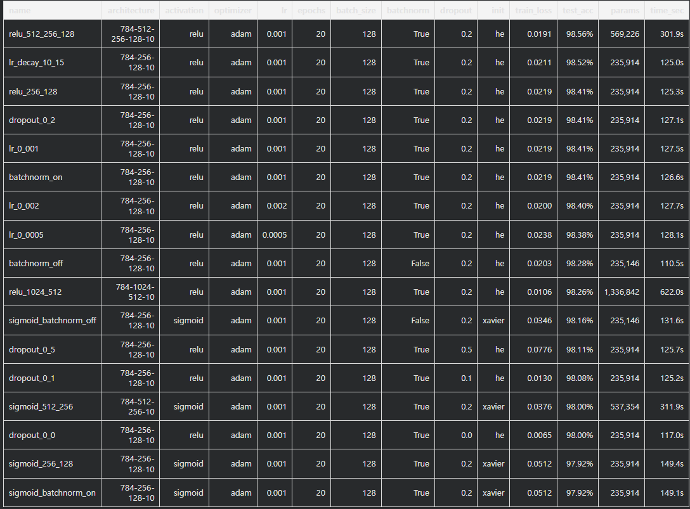

### 5.2 Loss curve

대부분의 모델은 epoch이 증가하면서 train loss가 안정적으로 감소했다. 특히 ReLU 기반 모델은 초반 수렴 속도가 빠르고, 마지막 epoch에서도 낮은 loss를 유지했다.

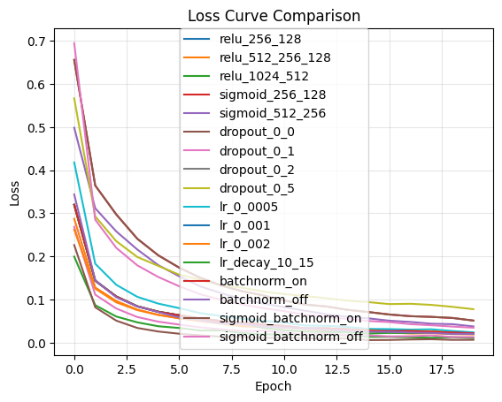

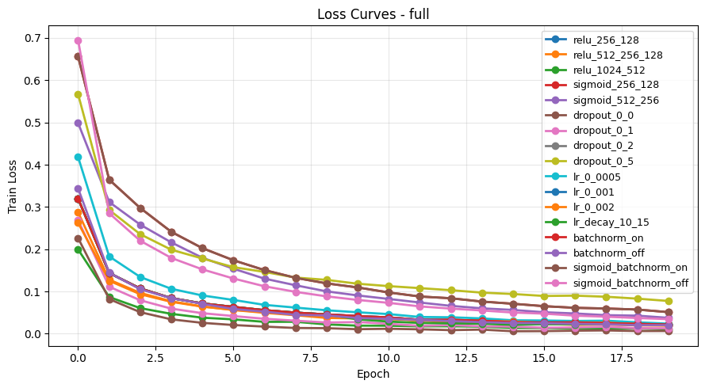

### 5.3 Test accuracy 비교

전체 모델의 test accuracy는 97.92% ~ 98.56% 범위에 분포했다. 과제 기준인 95%는 충분히 넘었고, 권장 기준인 97%도 모든 실험에서 만족했다.

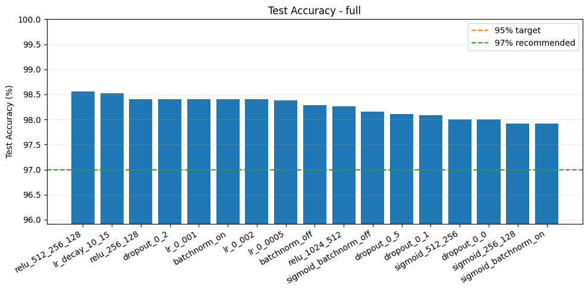

### 5.4 Learning rate 실험

learning rate 0.001이 98.52%로 가장 좋은 성능을 보였다. 0.0005는 수렴이 상대적으로 느렸고, 0.002는 너무 큰 learning rate로 인해 0.001보다 약간 낮은 성능을 보였다. epoch 10, 15에서 learning rate를 줄이는 decay 전략은 98.52%로 높은 성능과 짧은 학습 시간을 동시에 달성했다.

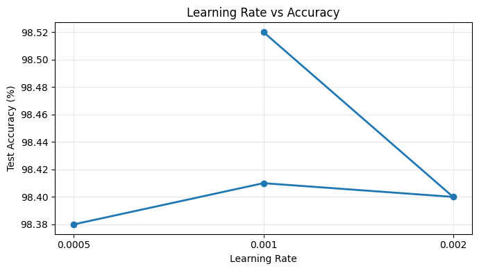

### 5.5 Dropout 실험

Dropout 0.2가 98.41%로 가장 좋은 test accuracy를 보였다. Dropout을 사용하지 않은 `dropout_0_0`은 train loss는 매우 낮았지만 test accuracy가 98.00%로 낮아져 과적합 경향을 보였다. Dropout 0.5는 규제가 강해져 train loss가 높고 성능도 98.11%로 감소했다.

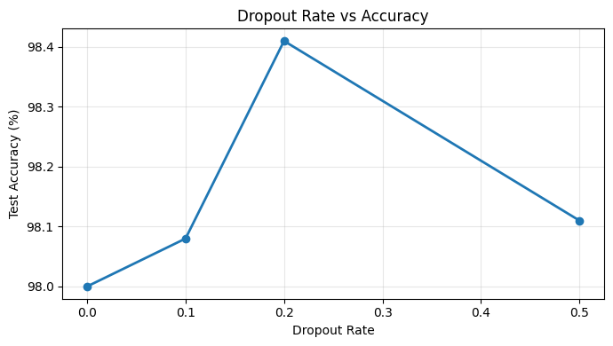

### 5.6 활성화 함수 비교

ReLU 모델이 Sigmoid 모델보다 전반적으로 좋은 성능을 보였다. 기본 구조에서는 `relu_256_128`이 98.41%, `sigmoid_256_128`이 97.92%였고, 더 깊은 구조에서도 `relu_512_256_128`이 98.56%, `sigmoid_512_256`이 98.00%였다.

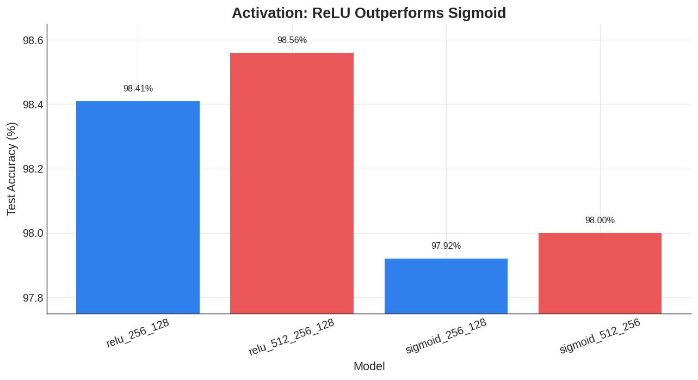

### 5.7 BatchNorm 비교

ReLU 기본 구조에서는 BatchNorm 적용 모델이 98.41%, 미적용 모델이 98.28%로 BatchNorm이 약간의 정확도 향상을 보였다. 다만 미적용 모델은 학습 시간이 110.5초로 더 짧아, 정확도보다 효율을 우선하면 `batchnorm_off`도 좋은 선택이다.

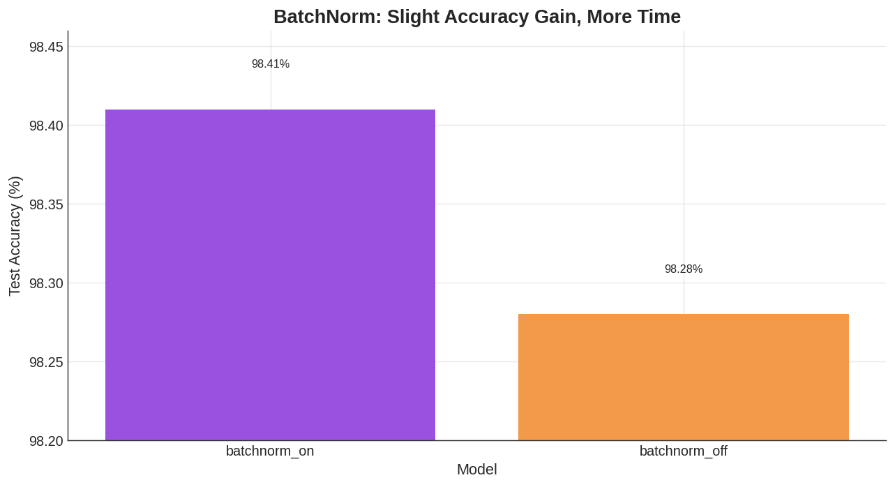

### 5.8 효율성 비교

Pareto frontier 기준으로 `lr_decay_10_15`와 `relu_512_256_128`이 성능과 시간의 균형이 좋았다. 단순히 가장 빠른 고성능 모델은 `batchnorm_off`, 가장 높은 정확도 모델은 `relu_512_256_128`이다.

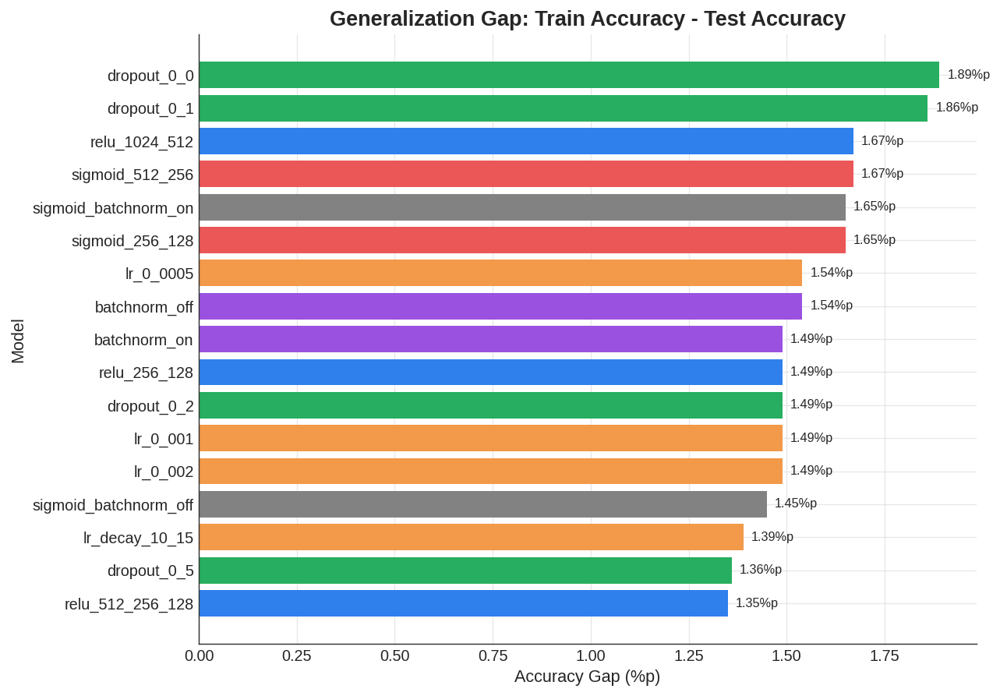

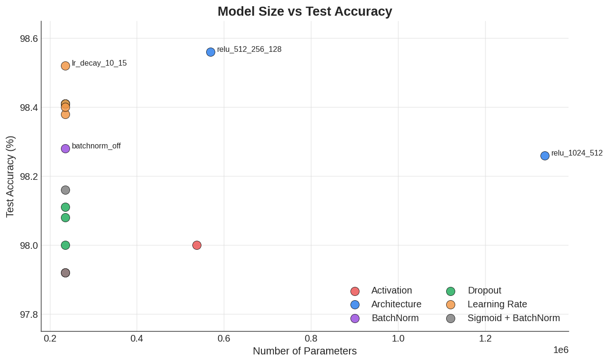

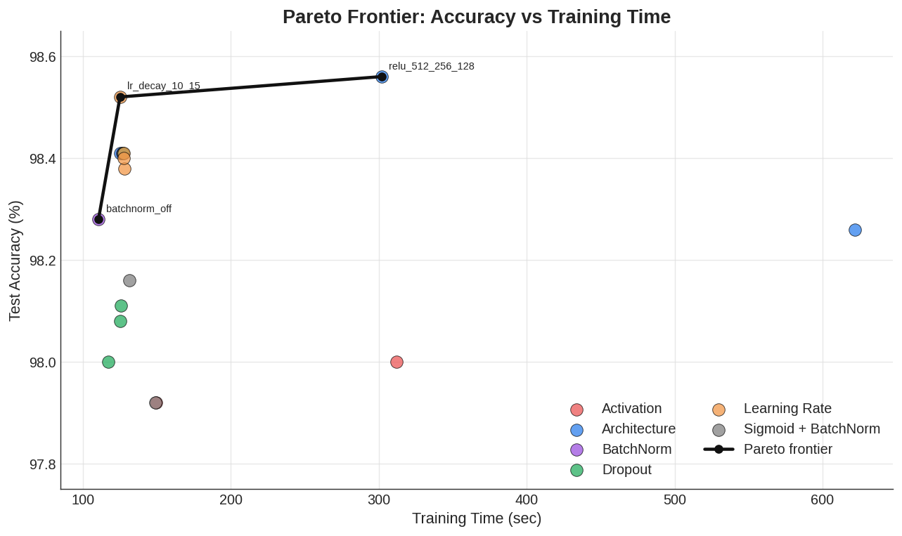

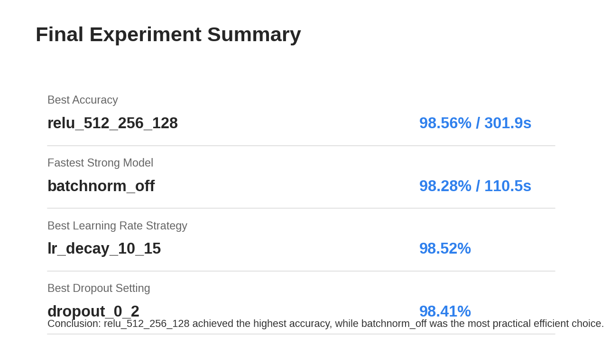

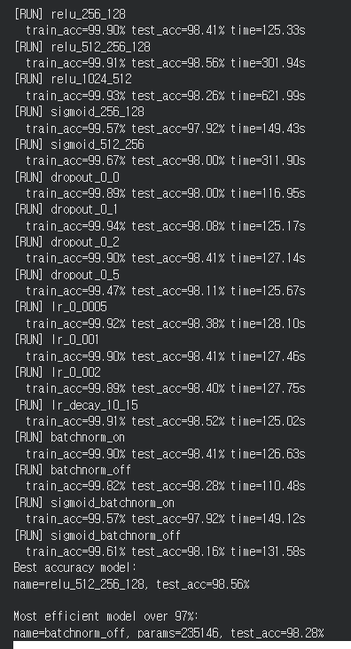

## 6. 회고

이번 실험에서는 NumPy만으로도 MNIST 분류에서 98% 이상의 test accuracy를 달성할 수 있음을 확인했다. 구현 관점에서는 Affine, activation, BatchNorm, Dropout, Softmax Cross Entropy, Adam optimizer를 직접 구성하면서 딥러닝 프레임워크 내부에서 일어나는 forward/backward 과정을 더 명확히 이해할 수 있었다.

수렴 측면에서는 모든 모델의 loss가 전반적으로 안정적으로 감소했으며, ReLU 계열 모델이 Sigmoid 계열보다 빠르고 높은 성능으로 수렴했다. Sigmoid는 gradient가 작아지는 문제가 있어 ReLU보다 불리했지만, Xavier 초기화를 사용하면 97% 이상의 성능은 충분히 달성했다.

과적합 관점에서는 Dropout을 사용하지 않은 모델이 train loss는 가장 낮았지만 test accuracy가 상대적으로 낮았다. 이는 학습 데이터에 더 강하게 맞춰진 결과로 볼 수 있다. Dropout 0.2는 일반화 성능이 가장 좋았고, Dropout 0.5는 규제가 너무 강해 학습 손실과 test accuracy가 모두 나빠졌다.

개선 시도 중 가장 효과적인 것은 ReLU 기반 구조 확장과 learning rate decay였다. `relu_512_256_128`은 가장 높은 정확도를 얻었지만 파라미터 수와 학습 시간이 늘어났다. 반면 `lr_decay_10_15`는 기본 모델과 같은 파라미터 수로 98.52%를 달성하여 성능과 효율의 균형이 좋았다. 최종 선택은 목적에 따라 달라진다. 최고 성능이 목표라면 `relu_512_256_128`, 빠르고 실용적인 제출 모델이 목표라면 `batchnorm_off` 또는 `lr_decay_10_15`가 적합하다.
